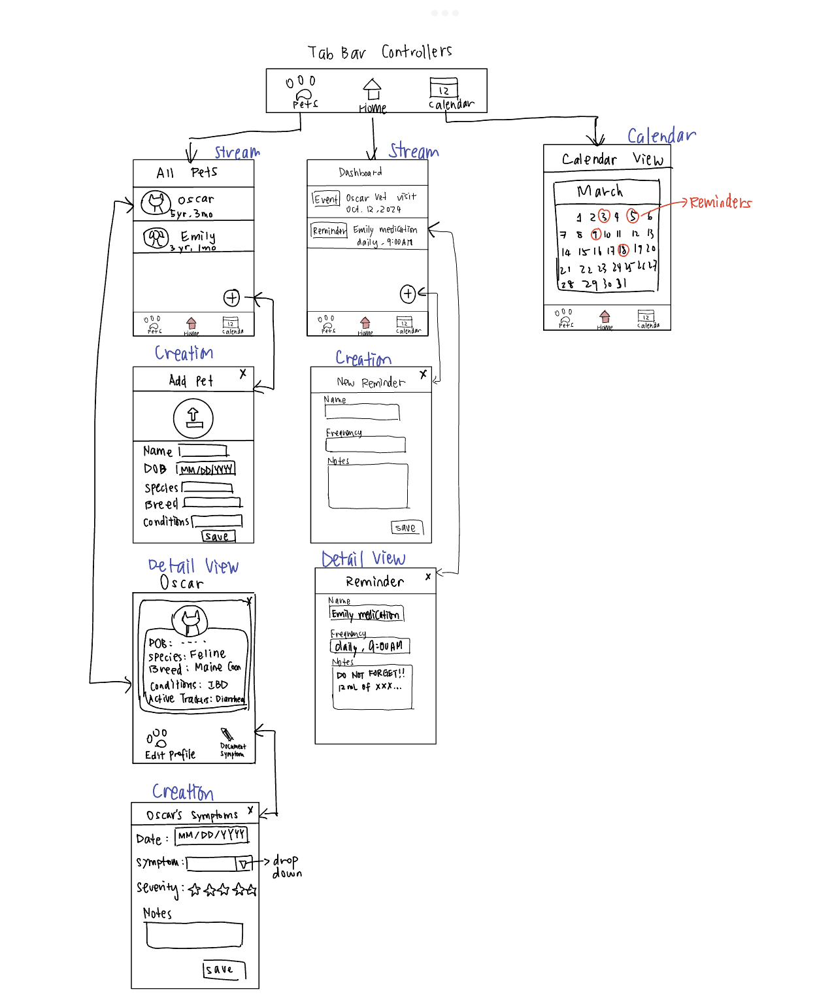

Original App Design Project
===

# Pet Health Tracker

## Table of Contents

1. [Overview](#Overview)
2. [Product Spec](#Product-Spec)
3. [Wireframes](#Wireframes)
4. [Schema](#Schema)

## Overview

### Description

Pet Health Tracker is an app for keeping our furry friends healthy and happy. Create reminders for vaccinations, medications, and check-ups. Track symptoms and health changes for pets with medical conditions. 
***Here is a demo video of my progress:*** https://youtu.be/LHknUrXSZLY

### App Evaluation

- **Category**: Productivity, Health
- **Mobile**: this app is inherently better suited as a mobile app because it provides a convenient way to document pet health status as well as to receive notification/reminders about important events like administering medication, vet appointment, and vaccinations, etc.
- **Story**: the value of this app is very clear and compelling, which is to maintain the wellbeing of our beloved furry friends. My peers responded very positively to the idea of this app.
- **Market**: Anyone who has pets could be benefited from this app. I expect the scale of market to be quite large, since 66% of American households own a pet as of 2024.
- **Habit**: The frequency of use depends on the purpose of use. For users tracking specific symptoms or using this app as a reminder for medications, the frequency would be likely one or twice per day. For users using this app as a place to store all of their pet's medical records, the use will vary depending on how often they would like to access those records.
- **Scope**: this app has a fairly well-defined scope and would be moderately challenging to implement before the end of program. Even a simplified version with only the symptom tracking feature and reminder would be interesting to implement.

## Product Spec

### 1. User Stories (Required and Optional)

**Required Must-have Stories**

- [ ] User can login/sign up/log out
- [x] User can add a new pet
- [x] Yser can remove an existing pet
- [ ] User can update pet profile, with ability to upload a profile picture
- [x] User can create events or reminders for pets
- [x] User can view upcoming events or reminders on the dashboard
- [x] User can view details of upcoming events or reminders
- [x] User can create symptom watch trackers
- [x] User can create symptom watch tracker entries to log daily pet symptoms

**Optional Nice-to-have Stories**

- [ ] User can visualize symptom changes over selected period of time through data visualization graphs and plots
- [ ] User can upload medical records of pet

### 2. Screen Archetypes

**Login Screen**
* User can log in/out

**Registration Screen**
* User can sign up

**Creation Screen**
* User can add new pet
* User can create symptom tracker
* User can create symptom watch tracker entries to log daily pet symptoms
* User can create events or reminders for pets
* User can upload medical records of pet

**Stream**
* User can view upcoming events or reminders

**Calendar View**
* User can visualize symptom changes over selected period of time through data visualization graphs and plots

**Detail View**
* User can view details of upcoming event/reminder
* User can view and update pet profile

### 3. Navigation

**Tab Navigation** (Tab to Screen)

* Home/Dashboard
* All Pets
* Calendar (optional)

**Flow Navigation** (Screen to Screen)
- Login Screen
    * => Home
- Registration Screen
    * => Home
- Home Screen
    * => Reminder detail view
    * => Create reminder screen
- All Pets Screen
    * => Add pet screen
    * => Pet detail view
        * => Add symptom monitoring entry screen
        * => Visualize symptom trends screen (optional)

## Wireframes

### [BONUS] Digital Wireframes & Mockups

### [BONUS] Interactive Prototype

## Schema 

[This section will be completed in Unit 9]

### Models

[Add table of models]

### Networking

- [Add list of network requests by screen ]
- [Create basic snippets for each Parse network request]
- [OPTIONAL: List endpoints if using existing API such as Yelp]
